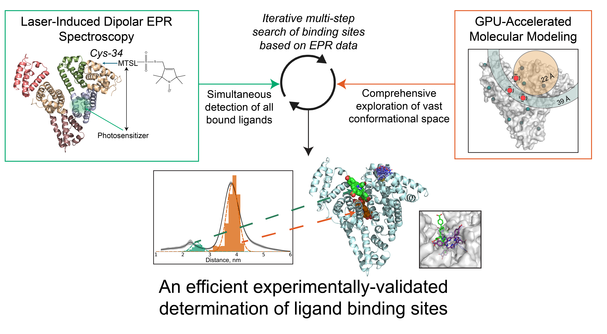

This version of the repository contains an example script of the HSA-TCPP docking (Examples/TCPP). Two notebooks describe both blind and focused docking with the comparison with experimental EPR data.

# To-Do
1. Include a finished script for the modeling of distance distributions based on the MD trajectory
# Protein-Ligand Binding Site Identification Based on Dipolar EPR Experiments
This project contains Jupyter Notebooks designed to identify binding sites in protein-ligand complexes using dipolar EPR distance distributions. The methodology is based on the approach described in the upcoming publication "Enhanced Binding Site Detection in Protein-Ligand Complexes with a Combined Blind Docking and Dipolar EPR Approach" (to be published).


## Repository Contents
This repository includes Jupyter Notebooks and helper scripts used for the binding site identification using dipolar EPR data.

## Required Software
This approach relies on AutoDock-GPU for both blind and focused docking. You can find AutoDock-GPU at:
https://github.com/ccsb-scripps/AutoDock-GPU

After installing AutoDock-GPU, make sure to specify the path to its executable file within the Jupyter Notebook for docking.
## Required Python Packages
For Docking and Spin Label Modeling:

- ADFR Suite (https://ccsb.scripps.edu/adfr/downloads/)
- MDAnalysis
- Antechamber
- Acpype - this workflow uses modified Acpype package that allows choosing the type of atom/bond type prediction. Until this feature is implemented in the main repository you can use my modified fork at (https://github.com/Mishakolok/acpype).
- RDKit
- Numpy
- ChiLife (https://github.com/StollLab/chiLife)
- SciPy
- Scikit-learn (SkLearn)
- Meeko (https://github.com/forlilab/Meeko)
- OpenBabel


This workflow uses GAFF2 parametrization of ligands, which require Amber force field installed for your MD package. You can find AmberFF14SB and other force field parameters for GROMACS at https://github.com/intbio/gromacs_ff

# Installation
This workflow is designed to run on Linux
1. Install AutoDock-GPU (either download pre-compiled binaries or build yourself) and put the path to the adgpu executable in the notebook
2. Install ADFRSuite
3. Get the following scripts from Autodock-Vina repository (https://github.com/ccsb-scripps/AutoDock-Vina) and put them in the vina_scipts directory
```
mapwater.py (for hydrated docking)
prepare_gpf.py
prepare_gpfzn.py (for docking with Zn)
prepare_flexreceptor.py (for flexible docking)
```
4. Install acpype from above-mentioned fork
5. Create conda environment with required packages using `conda create` or `mamba create`
```
conda create --name epr_bindsite numpy pandas matplotlib scipy scikit-learn meeko=0.6.1 ipykernel openbabel pymol-open-source mdanalysis -c conda-forge 
```
It is critical to use the latest Meeko version (0.6.1) due to RDKit compatibility.

6. Install additional packages
```
pip install chilife
pip install kneed
``` 
